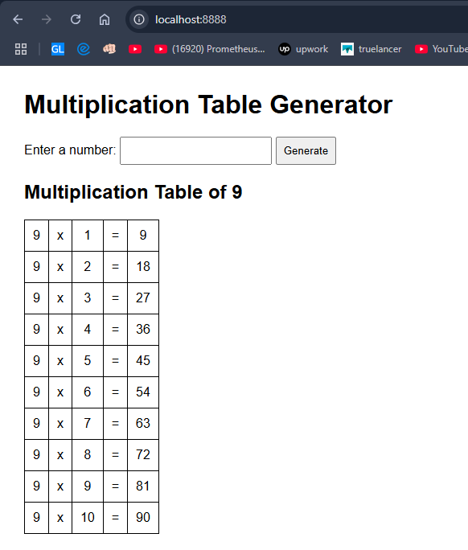

# Docker-Tutorial

# Flask Multiplication Tables App

A simple Flask web application that generates multiplication tables. This application is containerized using Docker for easy deployment and portability.

## Features

- 🧮 Generate multiplication tables for any number
- 🐍 Built with Python Flask
- 🐳 Dockerized for easy deployment
- 📱 Web-based interface
- ⚡ Lightweight and fast

## Prerequisites

Before running this application, make sure you have the following installed:

- **Docker** (recommended) - [Install Docker](https://docs.docker.com/get-docker/)
- **Python 3.9+** (if running without Docker)
- **pip** (Python package manager)

## Project Structure

```
.
├── app.py              # Main Flask application
├── requirements.txt    # Python dependencies
├── Dockerfile         # Docker configuration
└── README.md          # This file
```

## Installation & Usage

### Option 1: Using Docker (Recommended)

1. **Clone the repository**
   ```bash
   git clone <your-repository-url>
   cd <repository-name>
   ```

2. **Build the Docker image**
   ```bash
   docker build -t mbewaqar/table .
   ```

3. **Run the container**
   ```bash
   docker run -p 8888:5000 mbewaqar/table
   ```

4. **Access the application**
   Open your web browser and navigate to: `http://localhost:8888`

### Option 2: Running Locally (Without Docker)

1. **Clone the repository**
   ```bash
   git clone <your-repository-url>
   cd <repository-name>
   ```

2. **Create a virtual environment** (optional but recommended)
   ```bash
   python -m venv venv
   source venv/bin/activate  # On Windows: venv\Scripts\activate
   ```

3. **Install dependencies**
   ```bash
   pip install -r requirements.txt
   ```

4. **Run the application**
   ```bash
   python app.py
   ```

5. **Access the application**
   Open your web browser and navigate to: `http://localhost:8888`

## Output


## Docker Commands

### Build the image
```bash
docker build -t mbewaqar/table .
```

### Run the container
```bash
docker run -p 8888:5000 mbewaqar/table
```

### Run in detached mode
```bash
docker run -d -p 8888:5000 mbewaqar/table
```

### Stop the container
```bash
docker stop <container-id>
```

### View running containers
```bash
docker ps
```

## API Endpoints

- `GET /` - Home page with multiplication table interface
- `GET /table/<number>` - Generate multiplication table for specified number
- `POST /calculate` - Calculate multiplication table via form submission

## Configuration

The application runs on port 5000 by default. You can modify this in the `app.py` file:

```python
if __name__ == '__main__':
    app.run(host='0.0.0.0', port=5000, debug=True)
```

## Requirements

The application dependencies are listed in `requirements.txt`:
```
Flask==2.3.3
```

## Docker Image Details

- **Base Image**: Python 3.9
- **Working Directory**: `/app`
- **Exposed Port**: 5000
- **Entry Point**: `python ./app.py`

## Development

To contribute to this project:

1. Fork the repository
2. Create a feature branch: `git checkout -b feature-name`
3. Make your changes
4. Test your changes
5. Commit your changes: `git commit -am 'Add some feature'`
6. Push to the branch: `git push origin feature-name`
7. Submit a pull request

## Troubleshooting

### Common Issues

1. **Port already in use**
   ```bash
   # Use a different port
   docker run -p 8080:5000 multiplication-app
   ```

2. **Permission denied (Linux/Mac)**
   ```bash
   # Run with sudo or add user to docker group
   sudo docker run -p 5000:5000 multiplication-app
   ```

3. **Module not found error**
   ```bash
   # Make sure requirements.txt includes all dependencies
   pip freeze > requirements.txt
   ```

## Contributing

Contributions are welcome! Please feel free to submit a Pull Request.

## License

This project is open source and available under the [MIT License](LICENSE).

## Support

If you encounter any issues or have questions, please open an issue on GitHub.

---

**Made with ❤️ using Flask and Docker**